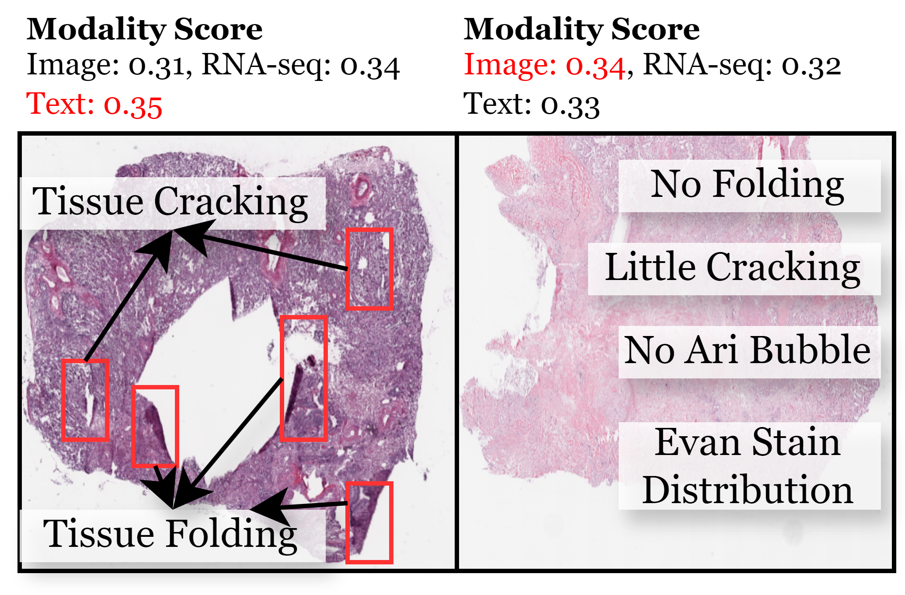

**Figure 1.** The gradient conflict between different modalities in the MIMIC-IV dataset. The `AMC w/ MoE` is the proposed AMC method, and `AMC w/o MoE` replaces the MoE to its dense counterpart. 

**Figure 2.** The case study about the modality data quality identified by our proposed modality importance. The image in the left side obtain the lowest modality importance, and the right side image obtain the highest modality importance.

**Figure 3.** The case study on token replacement within the MIMIC-IV dataset. Tokens are color-coded by modality: red blocks represent Code tokens, purple blocks indicate Lab tokens, and blue blocks signify Note tokens. The first row shows the token sequence before replacement. Each subsequent row displays the token sequence after replacement for a different instance. We random select 100 instance from the testing set for the visualization.

| **MIMIC-IV** | Code | Note | Lab || **ADNI** | Genomic | Image | Biospecimen | Clinical |
|---|:---:|:---:|:---:|-|---|:---:|:---:|:---:|:---:|
| Acc | **67.95** | 67.58 | 64.77 |-| Acc | 52.94 | 53.21 | 50.4 | **53.50** |
| Precision | 55.44 | 55.82 | **59.18** |-| Precision | 53.23 | **55.91** | 49.1 | 53.30 |
| Recall | 55.88 | 56.51 | **62.50** |-| Recall | 53.55 | **54.7**0 | 32.6 | 52.43 |
| F1 | 55.60 | 56.02 | **58.67** |-| F1 | 52.30 | **54.12** | 39.1 | 47.32 |

**Table 1.** The single modality performance with the same backbone in MIMIC-IV and ADNI datasets. Here we use the F1 score to indicate the modality importance (Higher is better).